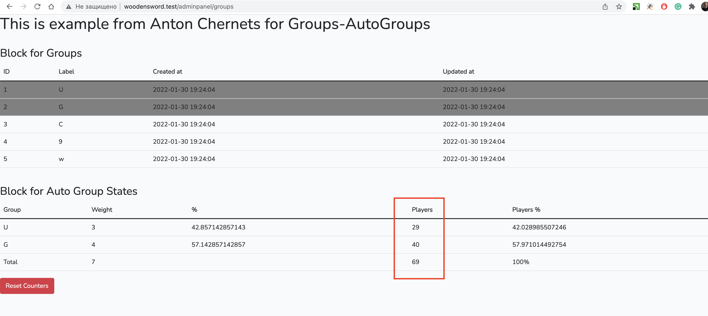
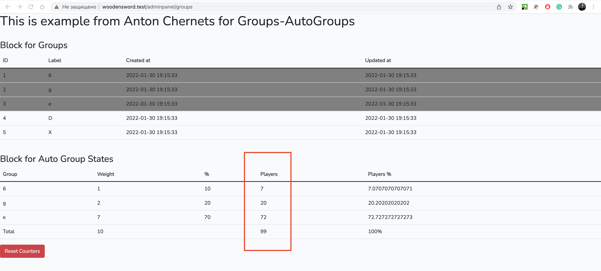

```
composer install
```
- add .env from .env.example with db connection and run commands
```
php artisan migrate
php artisan key:generate
```
- for data set
```
php artisan db:seed --class=DatabaseSeeder
```
- api routes
```
GET | www url ..api/create
```
- api docs Swagger for testing
```
www url ../api/documentation
```
- Run NPM
```
npm run dev
```
- web routes
```
www url ../adminpanel/groups
```
- examples different active weight

